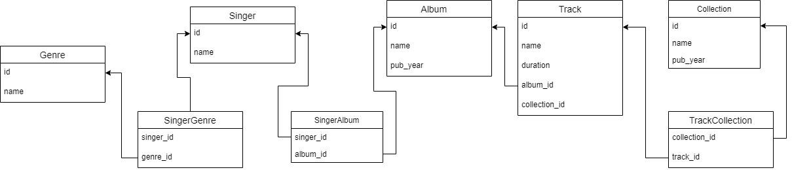

```sql
create table Genre (
	id serial primary key,
	name varchar(20)
);

create table Singer (
	id serial primary key,
	name varchar(20)
);

create table SingerGenre (
	singer_id integer references Singer(id),
	genre_id integer references Genre(id),
	constraint pk primary key (singer_id, genre_id)
);

create table Album (
	id serial primary key,
	name varchar(20),
	pub_year integer
);

create table SingerAlbum (
	singer_id integer references Singer(id),
	album_id integer references Album(id),
	constraint pk1 primary key (singer_id, album_id)
);

create table Collection (
	id serial primary key,
	name varchar(20),
	pub_year integer
);

create table Track (
	id serial primary key,
	name varchar(20),
	duration integer,
	album_id integer references Album(id)
);

create table TrackCollection (
	track_id integer references Track(id),
	collection_id integer references Collection(id),
	constraint pk2 primary key (track_id, collection_id)
);
```
